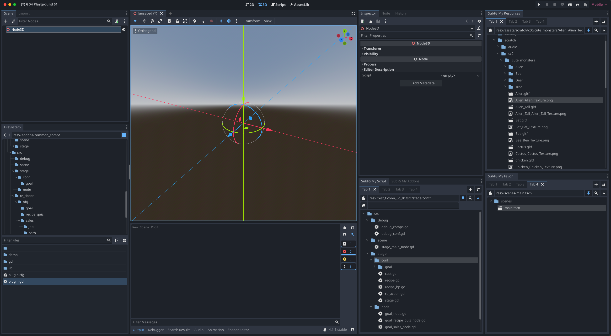

# Tabby Explorer plugin for Godot

Tabby Explorer is a plugin for the Godot Editor.

With this plugin, you can use your own multiple FileSystem docks and nested tabs
to organize complex folder structures according to your preferences.

While Godot Editor is excellent, it offers only a single FileSystem dock. 

I felt what I'm so exhauted and spending lot of time with scrolling up and down 
through the entire of my huge resources. The favorite system was not enough to me.
That was a reason why I built this plugin.

## Supported Version (Currently tested)

* godot 4.1 or higher

## Key Features

* Explore the file system of the Godot project
* Support multiple file system docks and Nested Tabs  each dock
* Support user-owned docks and project-shared docks
  * Configure by pressing the top-right button inside the dock panel
* Pin specific directories
  * Press the pin button to place them at the top inside the tab; other folders will be hidden
* Search for files and folders by resource path
  * Enter 'res://' path in the resource path field and press enter
* Search for resources by UID
  * Expand additional information by pressing the top-right button inside the tab
  * Enter 'uid://' in the UID field and press enter
* Integrate with default FileSystem dock 
  * Reveal selected item in the default FileSystem dock
  * Toggle the search button at the top-right inside the tab (default is on)
* Opening a resource by double-click
  * Opening the import panel (.glb/.gltf) is currently not functional. I will implement it once it becomes possible, considering the exposure of additional Godot APIs.
* Drag and drop support
  * You can use drag and drop like default FileSystem. However, move or remove files are in the future task.

## Tips and limitations

The plugin currently does not have fully implement FileSytem Features (for now), such as creating various scenes, resource and renaming, removing the files. Because the godot API is currently not exposed enough to integrate with them.

Best use case is using this plugin to organize folders. Use main filesystem features through default FileSystem. The Plugin's Reveal feature will help it.

You can try only following experimental features for now through plugin settings.
  * Create scripts
  * Create and remove folders
  * Remove files

## Experimental Features

* Write features
  * Create a directory
  * Remove folders and files
  * Create a script
  * Other features such as creating scenes or resources require exposing Godot APIs to deal with them.