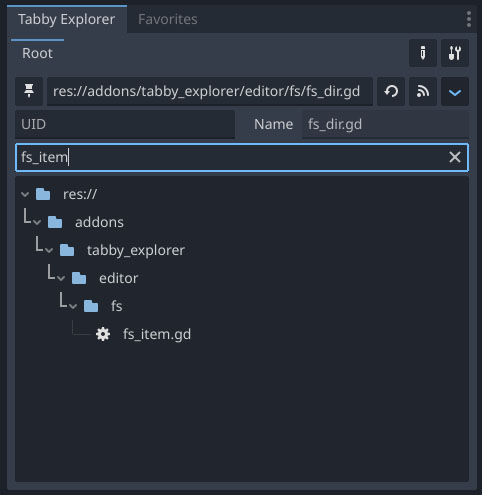

# Tabby Explorer plugin for Godot

Tabby Explorer is a plugin for the Godot Editor.

While Godot Editor is excellent, it offers only a single FileSystem dock. 

I felt what I'm so exhauted and spending lot of time with scrolling up and down 
through the entire of my huge resources. The favorite system was not enough to me.
That was a reason why I built this plugin.

With this plugin, you can use your own multiple FileSystem docks and nested tabs
to organize complex folder structures according to your preferences.

## Support this project

If you find this plugin helpful, please consider supporting the project.

## Supported Version (Currently tested)

* godot 4.0 or higher
* Currently tested version : godot 4.2

## Feature list (details are below)

* Explore the file system of the Godot project
* Support multiple file system docks
* Nested Tabs management each dock
* Support user-owned docks and shared-in-project docks
* Dedicated explorer dock for folders in Favorites
* Pin a folder to display a children only
* Search for files and folders by resource path
* Search for resources by UID
* Display addional informations, such as UID
* Integrate with default FileSystem dock via DFSI mode turning on
* Opening a resource by double-click
* Drag and drop (to another panel only) support

And following details

### Plugin settings panel

You can change the settings by the pressing the button at top-right inside panel.

### Multiple docks

Support multiple file system docks

### Nested tabs in each dock

Multiple tabs can be managed by user's preferences.

### Dedicated dock for Favorites

A dedicated dock for favorites. Each of folders in favorites will be used as tab in dock.

### Pin a specific folder

### Support user customized and shared in project docks both

Using project shared dock can shares dock configuration for teammates.
In the settings panel, everyusers can turn on/off them.

In default settings, showing project shared docks are turned off.

### Filtering

Filtering like default FileSystem also works.

### Toggle additional information (resource UID)

A resource's UID will display always. And you can find a file by UID through paste and hit enter key.

### Show in FileSystem

Select a file and pressing the button will navigate to a selected file in default FileSystem dock

## Future tasks

* Multi-selection
* Setting and displaying the Folder colors
* Fully, self implemented features without DFSI mode

## About DFSI (Default FileSystem dock Integrated) Mode

Currently, the plugin doesn't fully implement FileSystem features due to limitations in the exposed godot API.

To address this, Tabby Explorer employs a strategy of borrowing the PopupMenu functionality from the default FileSystem, avoiding the risk of independent implementation. This mode is referred to as DFSI mode.

DFSI mode, implemented through some clever tweaks, introduces additional features. These include a context menu that appears with a right mouse button click, enabling the opening of files handled by the default FileSystem dock.

You have the option to turn off DFSI mode within the settings. However, without DFSI mode, Tabby Explorer operates in a read-only mode.
